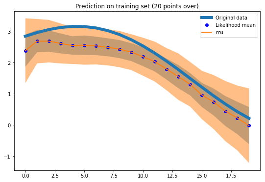

# deepar

[](https://travis-ci.com/arrigonialberto86/deepar)

Tensorflow implementation of Amazon DeepAR

DISCLAIMER: This package is under active development!

## Example usage:
Fit a univariate time series:
```python
%load_ext autoreload
%autoreload 2

from deepar.dataset.time_series import MockTs
from deepar.model.lstm import DeepAR

ts = MockTs()
dp_model = DeepAR(ts, epochs=50)
dp_model.instantiate_and_fit()
```
Util function for prediction (to be integrated into codebase):
```python
def get_sample_prediction(sample, fn):
    sample = np.array(sample).reshape(1, 20, 1)
    output = fn([sample])
    samples = []
    for mu,sigma in zip(output[0].reshape(20), output[1].reshape(20)):
        samples.append(normal(loc=mu, scale=np.sqrt(sigma), size=1)[0])
    return np.array(samples)
```

Plot results with uncertainty bands:
```python
%matplotlib inline
from numpy.random import normal
import tqdm
import pandas as pd
from matplotlib import pyplot as plt
import numpy as np

batch = ts.next_batch(1, 20)

ress = []
for i in tqdm.tqdm(range(300)):
    ress.append(get_sample_prediction(batch[0], dp_model.predict_theta_from_input))

res_df = pd.DataFrame(ress).T
tot_res = res_df

plt.plot(batch[1].reshape(20), linewidth=6)
tot_res['mu'] = tot_res.apply(lambda x: np.mean(x), axis=1)
tot_res['upper'] = tot_res.apply(lambda x: np.mean(x) + np.std(x), axis=1)
tot_res['lower'] = tot_res.apply(lambda x: np.mean(x) - np.std(x), axis=1)
tot_res['two_upper'] = tot_res.apply(lambda x: np.mean(x) + 2*np.std(x), axis=1)
tot_res['two_lower'] = tot_res.apply(lambda x: np.mean(x) - 2*np.std(x), axis=1)

plt.plot(tot_res.mu, 'bo')
plt.plot(tot_res.mu, linewidth=2)
plt.fill_between(x = tot_res.index, y1=tot_res.lower, y2=tot_res.upper, alpha=0.5)
plt.fill_between(x = tot_res.index, y1=tot_res.two_lower, y2=tot_res.two_upper, alpha=0.5)
plt.title('Prediction uncertainty')
```


