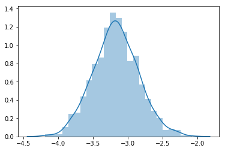

# deepar

[](https://travis-ci.com/arrigonialberto86/deepar)

Tensorflow implementation of Amazon DeepAR

Example usage:

```python
%load_ext autoreload
%autoreload 2

from deepar.dataset.time_series import MockTs
from deepar.model.lstm import DeepAR

ts = MockTs()
dp_model = DeepAR(ts, epochs=50)
dp_model.instantiate_and_fit()
```
```python
%matplotlib inline
from copy import copy

batch = copy(ts.next_batch(1, 20))

predictions = [dp_model.keras_model.predict(batch[0])[0][0] for i in range(1000)]
import seaborn as sns

sns.distplot([i[0] for i in predictions])
```

